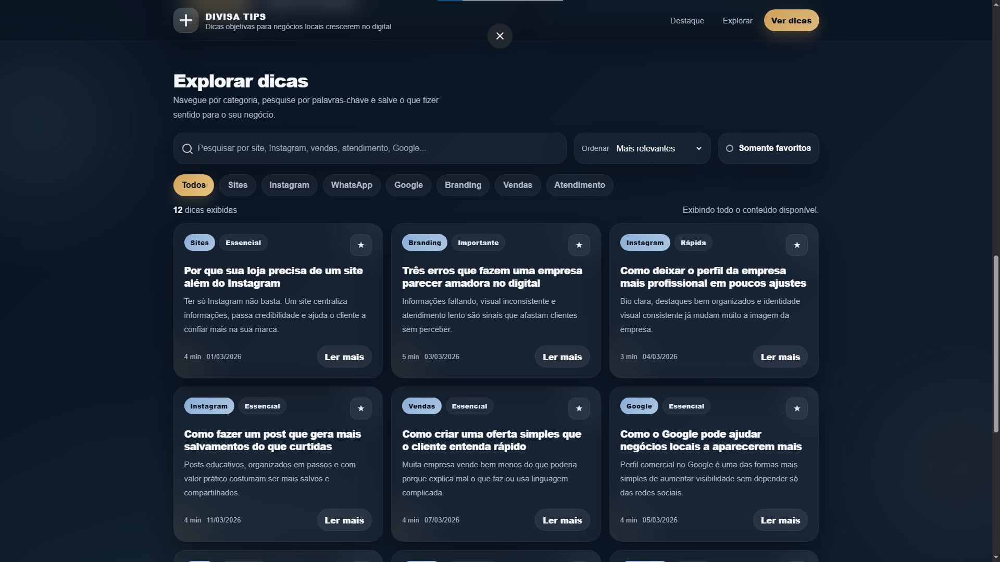

# Divisa Tips - Hub de Dicas para Negócios Locais

Projeto conceito de um hub de dicas desenvolvido com HTML, CSS e JavaScript, criado para ajudar negócios locais a melhorarem sua presença digital com conteúdos organizados, filtros por categoria, busca dinâmica e sistema de favoritos.

## Sobre o projeto

O **Divisa Tips** foi pensado como uma plataforma moderna de conteúdo para empreendedores, lojas e negócios locais que querem crescer no digital de forma mais organizada e estratégica.

A proposta do projeto é oferecer uma experiência visual limpa, elegante e funcional, onde o usuário pode navegar por dicas sobre sites, Instagram, WhatsApp, Google, branding, vendas e atendimento.

Além da parte visual, o projeto também trabalha com interações reais de interface, como pesquisa instantânea, filtros por categoria, ordenação, favoritos com armazenamento local e leitura detalhada em modal.

## Funcionalidades

- Busca dinâmica por palavras-chave
- Filtro por categorias
- Ordenação por relevância, data e leitura rápida
- Sistema de favoritos com localStorage
- Destaque principal com dica do dia
- Cards de dicas com visual moderno
- Modal de leitura detalhada
- Layout responsivo
- Interface elegante com paleta de cores reduzida
- Estrutura pensada para portfólio

## Categorias abordadas

- Sites
- Instagram
- WhatsApp
- Google
- Branding
- Vendas
- Atendimento

## Tecnologias utilizadas

- HTML5
- CSS3
- JavaScript

## Objetivo

Este projeto foi desenvolvido como uma demonstração prática para portfólio, unindo design, experiência do usuário, organização de conteúdo e interatividade em uma proposta visualmente profissional.

## Como executar

1. Baixe ou clone este repositório
2. Abra o arquivo `index.html` no navegador

## Observação

Este projeto é um protótipo funcional criado para fins de estudo, apresentação e portfólio.

## Autor

divisasites